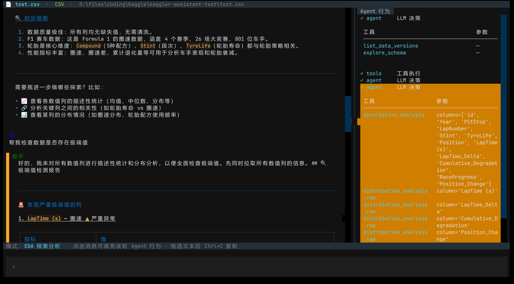
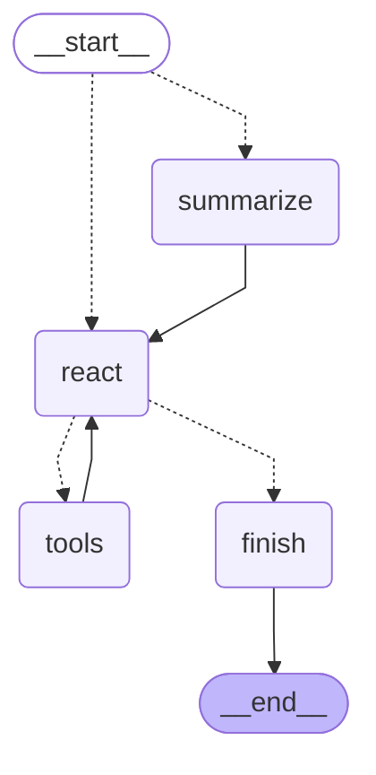

<p align="center">
  
</p>

<h1 align="center">KagglerAssistant</h1>

<p align="center">
  <em>基于 LLM Agent 的交互式数据分析助手</em>
</p>

<p align="center">
  
  
</p>

---

## 简介

KagglerAssistant 是一个基于 **LangGraph** + **DeepSeek** 构建的 LLM Agent，专为 Kaggle 风格的表格数据分析场景设计。加载 CSV 数据集后，通过自然语言对话即可完成探索性数据分析（EDA）与特征工程，无需手写代码。

## 功能

| 模式 | 工具 | 说明 |
|------|------|------|
| **EDA** | `explore_schema` | 获取列名、数据类型、缺失值、唯一值、示例值 |
| | `correlation_analysis` | 连续/分类/混合列的相关性分析（Pearson / Cramér's V / Eta²） |
| | `descriptive_analysis` | 数值列的均值、中位数、标准差、分位数等统计量 |
| | `distribution_analysis_raw` | 数值列分箱统计 / 分类列频率表 |
| | `distribution_fit` | 拟合常见分布（正态/均匀/指数/对数正态/伽马），含卡方与蒙特卡洛检验 |
| **特征工程** | `execute_empty_value` | 空值填充（零值/均值/中位数/众数）或删除 |
| | `encode_columns` | 独热编码 / 标签编码 |
| | `standardize_columns` | z-score 标准化 |
| | `drop_columns` | 删除指定列 |
| | `filter_rows` | 多条件组合行筛选（保留/删除） |
| | `execute_dim_reduct` | PCA / LDA 降维 |
| | `transform_column_mono` | 一元变换（log / sqrt / 三角 / 幂运算等） |
| | `transform_column_combination` | 多元交叉特征（乘积/比值/均值等） |
| **通用** | `switch_mode` | 切换 EDA / 特征工程模式 |
| | `switch_data_version` | 切换数据版本（回滚/重做） |
| | `list_data_versions` | 查看版本谱系 |

所有特征工程操作均通过**数据版本链**追踪，每次修改生成新版本，支持任意回滚。

## 快速开始

```bash
# 1. 克隆
git clone https://github.com/YoungZ2357/KagglerAssistant.git
cd KagglerAssistant

# 2. 安装依赖
pip install -e .

# 3. 配置 DeepSeek API Key
cp .env.example .env
# 编辑 .env 填入 DEEPSEEK_API_KEY

# 4. 启动 TUI 界面
kaggler
```

## 使用方式

### TUI 界面（推荐）

启动后输入 `/load-file` 选择 CSV 数据集，即可开始对话。

- 左栏：对话历史，支持 Markdown 渲染
- 右栏：Agent 行为追溯（节点流转 + 工具调用参数）
- `/switch <mode>` 命令切换模式（`eda` / `feature_engineering`）
- 点击左栏消息可联动高亮对应轮次的 Agent 行为

### CLI 模式

```bash
kaggler-cli 数据集.csv
```

单轮问答后自动退出，适合脚本化调用。

## 架构

```
┌─────────────────────────────────────────────────────┐
│                     入口层                            │
│    TUI (Textual)              CLI                    │
└──────────────┬──────────────────────┘               │
               │ AgentSession (wrapper)                │
┌──────────────▼──────────────────────────────────────┐│
│                   LangGraph 图                        ││
│  ┌──────────┐   ┌───────┐   ┌───────────┐          ││
│  │Summarize │──▶│ ReAct │──▶│ ToolNode  │          ││
│  └──────────┘   └───┬───┘   └───────────┘          ││
│                     │         │                     ││
│                     ▼         ▼                     ││
│                  Finish ◀─────┘                     ││
└──────────────┬──────────────────────────────────────┘│
               │                                        │
┌──────────────▼──────────────────────────────────────┐│
│                   运行时层                             │
│  ┌─────┐ ┌──────────┐ ┌────────────────────────┐   │
│  │EDA  │ │特征工程   │ │ DataProvider (版本管理) │   │
│  │工具 │ │工具       │ │                        │   │
│  └─────┘ └──────────┘ └────────────────────────┘   │
└─────────────────────────────────────────────────────┘
```

Agent图结构:


## 技术栈

| 类别 | 选型 |
|------|------|
| LLM Agent 框架 | LangChain + LangGraph |
| 语言模型 | DeepSeek（v4 Flash / Pro） |
| 数据处理 | Polars、NumPy、SciPy、scikit-learn |
| TUI 界面 | Textual |
| 配置/验证 | Pydantic + Pydantic Settings |
| CI | Ruff 检查 + Pytest 测试 + Gitleaks 秘钥扫描 |

## 项目结构

```
KagglerAssistant/
├── src/kaggler/
│   ├── app/          # TUI + CLI 入口
│   ├── graph/        # LangGraph 图（state / nodes / edges / assembly）
│   ├── modes/        # EDA / 特征工程 / 通用工具
│   ├── persistence/  # DataProvider + 数据版本管理
│   ├── shared/       # 公共类型、配置、序列化、wrapper
│   └── knowledge/    # 知识库（预留）
├── tests/            # pytest 测试（含 FakeChatModel 无网络测试）
├── docs/             # 开发备忘 + 截图
└── scripts/          # 辅助脚本（图可视化等）
```

## 许可证

[MIT](LICENSE)
