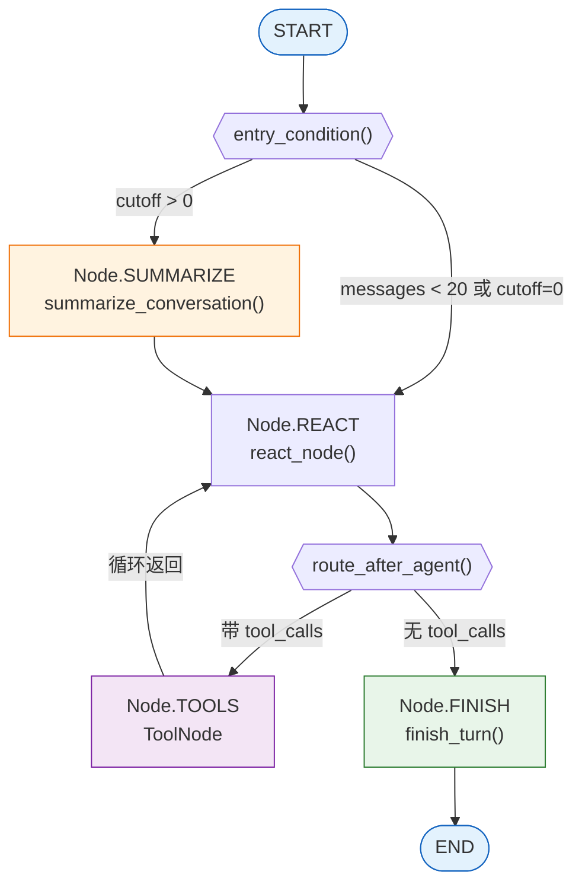
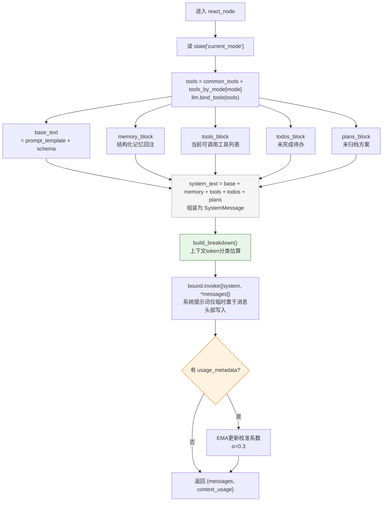
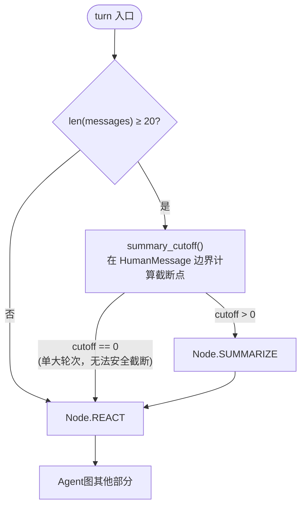
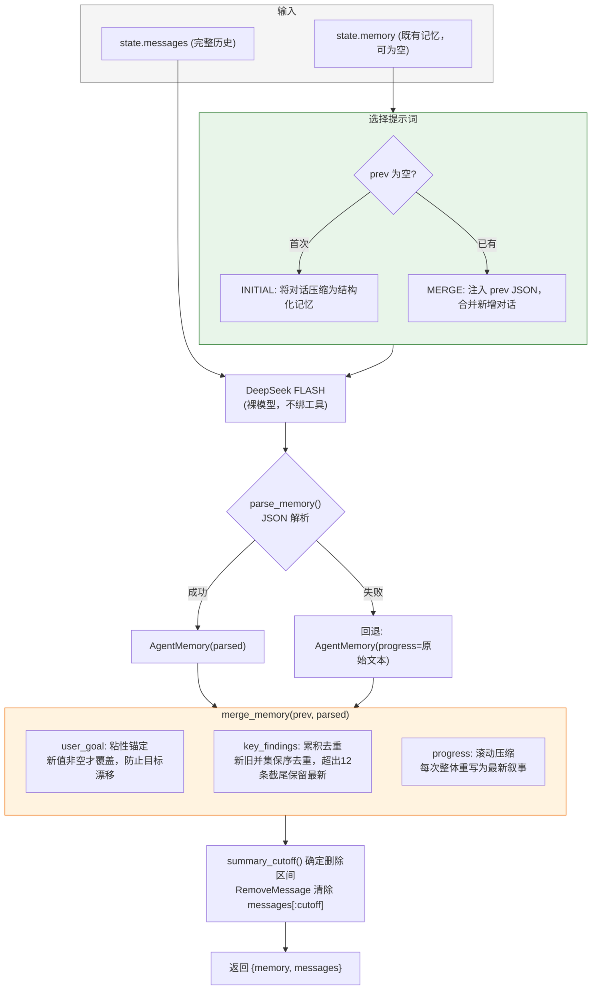
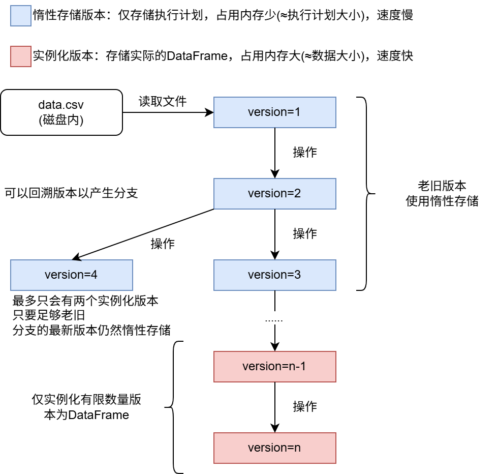
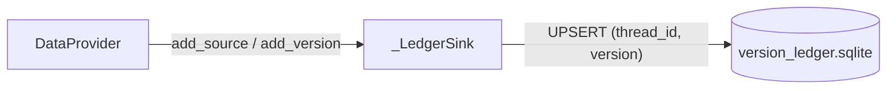
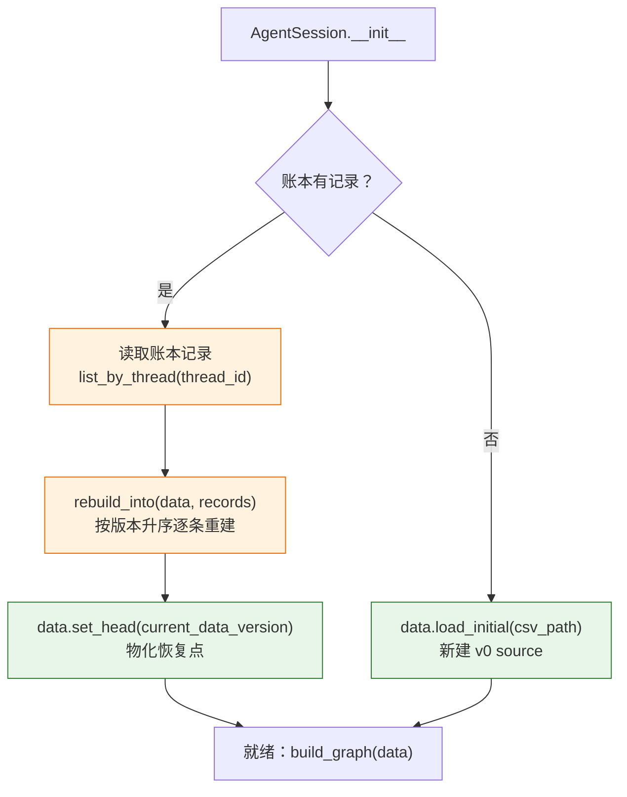
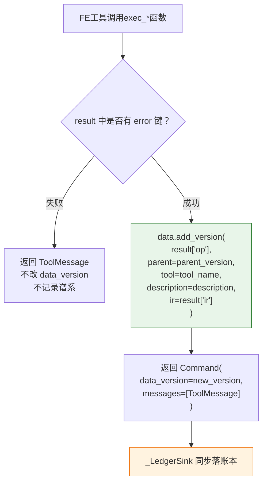

# 项目设计文档


## 1 Agent及其组件

### 1.1 图架构总览

该项目为单Agent架构，基于LangGraph的`StateGraph`编译为带持久化checkpoint的`CompiledStateGraph`。图由**4个节点**和**4条边**组成：



**4个节点**（`src/kaggler/graph/types.py`）：

| 节点 | 枚举值 | 职责 |
|---|---|---|
| `REACT` | `"react"` | ReAct推理循环：绑定工具、组装系统提示词、调用LLM |
| `TOOLS` | `"tools"` | LangGraph `ToolNode`：执行LLM请求的工具调用 |
| `SUMMARIZE` | `"summarize"` | 对话压缩：将历史消息压缩为结构化记忆，删除旧消息 |
| `FINISH` | `"finish"` | 收尾节点：递增turn计数，作为每个turn的确定性终点 |

**路由逻辑**（`src/kaggler/graph/edges.py`）：

- `entry_condition()`：每个turn的入口路由。消息数不足20条→直接REACT；达阈值时计算`summary_cutoff`，若确有可安全删除的消息→SUMMARIZE，否则跳过压缩直接REACT。
- `route_after_agent()`：REACT之后路由。若LLM回复的最后一条`AIMessage`携带`tool_calls`→TOOLS执行工具；否则→FINISH收尾。
- TOOLS→REACT的固定边构成ReAct循环（思考→行动→观察→思考）。
- SUMMARIZE→REACT的固定边确保压缩后立即进入推理。

---

### 1.2 状态管理

图状态定义在`CommonState`（`src/kaggler/graph/state.py:50`），继承自LangGraph的`MessagesState`（自带`messages`列表及其`add_messages` reducer）。扩展字段如下：

| 字段 | 类型 | Reducer | 说明 |
|---|---|---|---|
| `current_mode` | `Mode` | `_take_latest` | 当前工作模式（EDA / FEAT_ENG） |
| `file_path` | `str` | 默认LastValue | CSV源数据文件路径 |
| `explored_schema` | `str` | 默认LastValue | 数据集schema文本，填充进模式提示词的`{schema}`占位符 |
| `turn` | `int` | `_add_turns` | 累计对话轮数（每个FINISH节点+1） |
| `memory` | `dict` | `_take_latest` | 结构化记忆的dict形式（`AgentMemory.to_dict()`的输出） |
| `data_version` | `int` | `_take_latest` | 当前工作版本号，指向DataProvider的HEAD |
| `todos` | `list[dict]` | `_upsert_by_id` | 待办挂起列表 |
| `plans` | `list[dict]` | `_upsert_by_id` | 方案挂起列表 |
| `context_usage` | `dict` | `_take_latest` | 最近一次react的上下文token分类拆分（供TUI可视化） |

**Reducer说明**：
- `_take_latest`：后写覆盖先写。解决同一super-step内多次写入（如LLM同时调用两个工具产生两个`Command(update={"data_version": ...})`）会抛`InvalidUpdateError`的问题。
- `_add_turns`：累加器，每次FINISH节点返回`{"turn": 1}`时自动累加。
- `_upsert_by_id`：按`id`字段upsert合并。新项（id缺省）自动分配自增id；已有项部分更新；同一super-step内多次add也不会撞号。

---

### 1.3 模式系统与ReAct推理

#### 1.3.1 模式定义

项目定义两种模式（`src/kaggler/shared/types.py`）：

> 注：更多工具仍在开发中，将根据实际应用来编写其他的工具和模式

```python
class Mode(str, Enum):
    EDA = "eda"                     # 探索性数据分析
    FEAT_ENG = "feature_engineering"  # 特征工程
```

每个模式在注册表`REGISTRY`（`src/kaggler/modes/registry.py:42`）中以`ModeSpec`记录：

```python
@dataclass
class ModeSpec:
    tool_factory: Callable[[DataProvider], list[BaseTool]]  # 工具工厂
    prompt: str                                               # 系统提示词模板
```

| 模式 | 提示词模板 | 特化工具有限 | 核心职责 |
|---|---|---|---|
| EDA | 强调仅做探索分析、数据泄露防范 | 5个：explore_schema、correlation_analysis、descriptive_analysis、distribution_analysis_raw、distribution_fit | 读数据分析 |
| FEAT_ENG | 强调特征工程、数据泄露防范（标签隔离、禁止目标编码等） | 9个：execute_empty_value、encode_columns、standardize_columns、drop_columns、filter_rows、create_indicator_column、execute_dim_reduct、transform_column_mono、transform_column_combination | 读写数据变换 |

两种模式的提示词模板均含`{schema}`占位符，由`react_node`在每次推理前用`state["explored_schema"]`的值填充。schema由EDA的`explore_schema`工具产出并写入state。

**通用工具**（9个）在所有模式下始终可用：`switch_mode`、`switch_data_version`、`list_data_versions`、`list_workspace_files`、`export_data_version`、`add_todo`、`complete_todo`、`add_plan`、`update_plan`。

#### 1.3.2 ReAct推理流程

每次进入`react_node()`（`src/kaggler/graph/nodes.py:40`）时执行以下步骤：

1. **读当前模式**：从`state["current_mode"]`获取当前模式枚举值。
2. **按模式绑定工具**：`tools = [*common_tools, *tools_by_mode[mode]]`——当前模式的特定工具 + 通用工具的并集。通过`llm.bind_tools(tools)`绑定，确保LLM仅能调用当前模式许可的工具集。
3. **组装系统提示词**（5块拼接）：
   - **base_text**：模式提示词模板 + 当前schema文本。
   - **memory_block**：若`state["memory"]`非空，渲染为`[Agent对之前对话的已知信息]`块，注入压缩后历史上下文。Agent应基于此延续分析，但不向用户逐字复述。
   - **tools_block**：显式列出当前可调用的工具名列表。切模式后绑定集已变，此块防止模型被历史中的旧模式tool_calls误导，尝试调用已不可用的工具。
   - **todos_block**：渲染当前未完成的待办列表（含使用指引）。每turn回注、不参与压缩。
   - **plans_block**：渲染当前未归档的方案列表（含使用指引）。同待办，每turn回注、不参与压缩。
4. **上下文占用估算**：调用`build_breakdown()`按类别（system/summary/tools/user/assistant/tool_results）拆分token估算，产出`ContextBreakdown`供TUI可视化面板。
5. **LLM推理**：`bound.invoke([system_message, *state["messages"]])`——系统提示词仅临时置于消息列表头部，不写入state。
6. **校准**：若LLM返回`usage_metadata.input_tokens`（真实prompt token数），用实测值与原始估算的比值做EMA更新校准系数（α=0.3），使离线估算随使用自我收敛。
7. **返回**：LLM回复追加进`messages`，上下文占用拆分写入`context_usage`。



---

### 1.4 对话总结

为防止长对话耗尽上下文窗口，每个 turn 入口处设有摘要路由。
当历史消息达到阈值且存在可安全删除的旧消息时，由LLM将早期对话压缩为结构化记忆，随后删除已覆盖的旧消息。
压缩后的记忆在后续 React 推理中通过系统提示词回注，确保 Agent 不丢失对历史上下文的理解。

**可调参数**（`src/kaggler/shared/config.py:12`）：

| 参数 | 默认值 | 作用 |
|---|---|---|
| `summary_trigger_count` | 20 | 消息总数 ≥ 该值时进入摘要检查 |
| `summary_keep_recent` | 4 | 截断后保留的最近 HumanMessage 回合数 |
| `key_findings_cap` | 12 | 累积关键发现的保留上限 |

#### 1.4.1 触发与路由



`summary_cutoff()`（`src/kaggler/graph/nodes.py:151`）同时受两条约束控制：

- **回合预算**：保留最近`keep`个HumanMessage，其余可删。
- **消息数上限**：当消息数达`trigger`时，进一步保证保留数 < `trigger`，防止摘要后立即再次触发（消除工具密集回合下的"每轮总结"现象）。
- 截断点始终落在HumanMessage边界，不会割裂`AIMessage(tool_calls)`与其`ToolMessage`。

两条约束取更靠后的截断点（删得更多），但若全部消息属于单个进行中的巨型回合（无安全截断点），返回0→跳过压缩、直接REACT，避免空转一次无效的摘要LLM调用。

#### 1.4.2 结构化记忆

记忆采用三段式结构（`AgentMemory`，`src/kaggler/graph/memory.py:22`），各段有不同的生命周期：

| 字段 | 类型 | 生命周期策略 |
|---|---|---|
| `user_goal` | `str` | **粘性锚定**：只在意图明确改变时更新，不随每次摘要重压缩，防止Agent随轮次推进丢失最初的业务框架 |
| `key_findings` | `list[str]` | **累积去重**：合并时新旧并集保序去重，超出`key_findings_cap`（默认12）时截尾保留最新 |
| `progress` | `str` | **滚动压缩**：每次整体重写为最新叙事，是对被删除消息片段的真正压缩 |

#### 1.4.3 摘要生成与记忆合并



**解析容错**（`parse_memory()`）：支持中文键（用户目标/关键发现/进展）与英文键（user_goal/key_findings/progress）两种写法；剥离Markdown代码围栏（```json...```）。解析失败时保留旧记忆，将原始输出整体并入progress字段，避免本轮信息净丢失。

记忆写入 state 后，后续 `react_node()` 通过 `render_memory()` 将三个字段渲染为文本，以 `[Agent对之前对话的已知信息]` 标记注入系统提示词。Agent 可基于此延续分析，但不应向用户逐字复述。

---

### 1.5 长期上下文保留：待办与方案

除了摘要压缩，项目通过**待办（todos）**和**方案（plans）**两套机制完成长期上下文保留。两者的共同特点是：**每turn逐字回注进系统提示词、永不进摘要压缩**，因此LLM的自发承诺不会随长程压缩丢失。

| 机制 | 用途 | 生命周期 | 工具集 |
|---|---|---|---|
| 待办 todos | 可立即执行的原子步骤，做完即勾掉 | open → done（勾掉后不再注入） | `add_todo`、`complete_todo` |
| 方案 plans | 尚未定型但重要、需反复修订的规划性内容 | draft → active → archived（归档后不再注入） | `add_plan`、`update_plan` |

**待办渲染**（`_render_todos_block()`）：始终附带使用指引（告知Agent可用工具），列出所有`status != "done"`的待办项及其`[#id]`。Agent看到后可直接调用`complete_todo`勾选。

**方案渲染**（`_render_plans_block()`）：始终附带使用指引，逐字列出所有`status != "archived"`的方案的完整标题+正文+状态标签。方案正文完整注入系统提示词，因此即使是长达数行的技术路线、设计取舍也能原样留存。

两者共用一个`_upsert_by_id` reducer（`src/kaggler/graph/state.py:25`）：同一super-step内多次add不撞号、部分更新不覆盖未传入字段。

---

### 1.6 图组合与会话封装

#### 1.6.1 图的编译

`build_graph()`（`src/kaggler/graph/assembly.py:41`）是构图入口，被执行时完成：

1. 加载`.env`中的`DEEPSEEK_API_KEY`。
2. 遍历`REGISTRY`，调用各`ModeSpec.tool_factory(data)`实例化所有模式的特有工具。
3. 创建两档LLM实例（PRO用于react，FLASH用于summary）。
4. 收集全量工具并集（common + 全mode）构造`ToolNode`。
5. 以`functools.partial`将依赖注入节点/边函数，避免在构建期硬编码。
6. 编译为`CompiledStateGraph`——checkpointer默认为`MemorySaver`（内存、无持久化），由调用方注入`SqliteSaver`后自动升级为SQLite持久化。

#### 1.6.2 AgentSession

`AgentSession`（`src/kaggler/shared/wrapper.py:76`）是对「加载数据→建图→种子注入→流式问答」的高层封装：

- **新建对话**：`load_initial(csv_path)` 创建v0源版本，首轮注入种子state（`current_mode=EDA`、`file_path`、`data_version=0`）。
- **恢复对话**：从版本账本`rebuild_into()`重建版本树，检查点的`data_version`对齐HEAD；后续轮次仅传入新问题，`_seeded=True`阻止再次覆盖种子state。
- **流式事件**：`stream_events()`产出结构化事件（`node_active`、`token`、`node_done`、`mode_change`、`context`），供TUI同时驱动回答文本与Agent行为追溯面板。

#### 1.6.3 SessionManager

`SessionManager`（`src/kaggler/shared/session_manager.py:76`）是对话生命周期的composition root：

- `create_conversation(csv_path)`：生成thread_id → LLM自动命名 → 写`ConversationStore`元数据 → 创建`SqliteSaver` → 返回`AgentSession`。
- `resume_conversation(thread_id)`：从`ConversationStore`读元数据 → `SqliteSaver`按thread恢复checkpoint → 从版本账本重建版本树 → 返回`AgentSession`。
- `delete_conversation(thread_id)`：先清除LangGraph checkpoint（purge state/writes），再删版本账本记录，最后删应用层元数据。
- `list_conversations()`：按工作区列出全部对话记录。


## 2 数据管理
### 2.1 数据版本
该项目中，"数据版本"是Agent可感知的最小数据单元。数据版本直接指向一个`polars.DataFrame`或者`polars.LazyFrame`，即某种形式的完整数据。

数据版本由如下的方式产生：
1. 应用读取了数据 - 产生第一个数据版本
2. 应用在内存对数据进行了修改 - 产生变更后的数据版本

数据的版本管理使用`DataProvider`实现，所有工具需要使用实例化的`DataProvider`来获取指定的数据版本或者新增数据版本。

每个版本称为一个 **source** 或一个 **derived** 版本：
- **source**：无父版本，持有一个`Loader`（`Callable[[], pl.DataFrame]`），注册即加载并物化。root 版本的 source 来自 `add_source`，恢复对话时从持久化快照重建的 source 由 `restore_source` 注册。
- **derived**：有父版本，持有一个`Op`（`Callable[[pl.LazyFrame], pl.LazyFrame]`），是对父版本数据框架的惰性变换。`Op`必须是闭合于父版本输入的确定性函数；若变换需拟合参数（均值、编码映射、PCA权重等），这些参数在`Op`创建时固化进闭包。

所有版本通过单调递增的整数版本号唯一标识，版本号分配（`_alloc`）与物化状态解耦——版本号一旦分配永不回收。

每个版本携带一份`VersionInfo`谱系元数据：

```python
@dataclass
class VersionInfo:
    parent: int | None      # 父版本号，source 为 None
    tool: str | None        # 产生该版本的工具名
    description: str        # 简要描述
    reproducible: bool = True  # 是否可确定性复现
```

---

### 2.2 惰性存储
利用`polars`的惰性运算功能，绝大多数数据版本以`polars.LazyFrame`的形式存储。

`Op`签名为`Callable[[pl.LazyFrame], pl.LazyFrame]`——每步变换接收父版本的LazyFrame，产出本版本的LazyFrame。这种设计使得整个版本链可融合为一次polars query plan，通过单次`.collect()`触发全部pushdown优化。



---

### 2.3 DataProvider 架构

`DataProvider`（`src/kaggler/persistence/data_provider.py`）是版本存储层的唯一入口和权威实现。其内部结构如下：

| 属性 | 类型 | 说明 |
|---|---|---|
| `_lineage` | `dict[int, VersionInfo]` | 全量版本的存在性真相（含lazy版本） |
| `_ops` | `dict[int, Op]` | 派生版本的变换闭包（source不在此） |
| `_loaders` | `dict[int, Loader]` | source的数据加载函数（派生版本不在此） |
| `_ir` | `dict[int, IRNode \| None]` | 每个版本的IR节点，持久化与代码导出均以此为源 |
| `_materialized` | `dict[int, pl.DataFrame]` | 物化缓存——全部版本的子集 |
| `_last_access` | `dict[int, float]` | LRU访问时间戳 |
| `_pinned` | `set[int]` | 受保护不被淘汰的版本号集合 |
| `_next_version` | `int` | 单调递增的版本号计数器 |
| `_root` | `int \| None` | 根版本号 |
| `_head` | `int \| None` | 当前工作HEAD版本号 |

**核心设计原则**：
1. 版本身份（存在性/版本号）与物化状态彻底解耦——`_lineage`是唯一真相，`_materialized`是其子集。
2. 物化/淘汰不改变`data_version` token——逻辑版本身份对上层透明，是纯存储层行为。
3. 派生`Op`是纯内存闭包，无需可序列化spec。数据变换的语义由IR单独承载。
4. source与derived统一建模：source持`Loader`（无parent），derived持`Op`（有parent），为持久化重载留出干净接缝。
5. 可重算性由「root可通过loader重建」保证，因此淘汰任何非pinned、非HEAD的物化版本永远安全。

构造参数：

| 参数 | 默认值 | 说明 |
|---|---|---|
| `max_materialized` | 3 | 同时常驻的物化版本数上限 |
| `cache_on_read` | False | 读取lazy版本后是否物化并纳入LRU |
| `pin_root` | True | root版本是否常驻不被淘汰 |
| `sink` | None | 持久化端口——每登记一个版本就通知一次 |

`sink`是一个`VersionSink`协议对象，由组合根注入，`DataProvider`仅调用该协议而不感知SQLite或thread_id。无`sink`时DataProvider为纯内存模式（用于CLI或单测）。

---

### 2.4 物化淘汰策略

**物化预算**由`max_materialized`控制（默认3）。当物化缓存超过上限时触发LRU淘汰：

1. 收集淘汰候选：`_materialized` \ `_pinned` \ `{_head}`——即排除所有受保护版本。
2. 按`_last_access`取最久未访问的版本（LRU），释放其物化数据。
3. 淘汰仅清空`_materialized`条目；版本的血缘（`_lineage`）、`Op`/`Loader`、`IR`均保留，此后通过`_compute`重算即可恢复。
4. 若全部物化版本均受保护（全被pin或皆为HEAD），宁可暂时超预算也不破坏正确性。

**Pinned版本**：永远不被淘汰的版本集合，包括：
- root版本（`pin_root=True`时自动加入）
- 不可复现版本（`reproducible=False`的随机变换，重算会与原值分叉）
- 用户显式pin的版本（如编码、大groupby等昂贵变换）
- 当前HEAD（head在物化时自动受保护，切换后旧HEAD降级为可淘汰）

`pin` / `unpin`方法提供手动控制。不可复现版本在`unpin`时抛出错误。

**重算机制**（`_compute`，`src/kaggler/persistence/data_provider.py:414`）：
1. 从目标版本向source方向回溯，找到最近的已物化祖先。
2. 若祖先未被物化（如source被淘汰），通过`Loader`重建。
3. 从该祖先出发，正向按顺序replay链上的各步`Op`。
4. 整条链融合为一次`lf.collect()`——polars的query plan pushdown使得多步变换的成本接近一步。

---

### 2.5 版本切换与回滚

`set_head(version)`将当前工作指针迁移到任意已存在的版本号：
- 目标版本被物化（若尚未物化则触发`_compute` + 物化）。
- 旧HEAD自动降级为可淘汰——无需手动unpin，不遗留僵尸pin。
- 切换后触发`_evict_if_needed`。

Agent通过`switch_data_version`工具触发切换，工具内部调用`data.set_head(version)`并返回`Command(update={"data_version": version, ...})`，将图状态中的`data_version`字段更新为新值。

`list_data_versions`工具返回按版本号升序的版本列表，包含每个版本的`is_head`、`materialized`、`pinned`状态及完整的`VersionInfo`字段，供Agent在切换前浏览选择。

---

### 2.6 IR 中间表示

IR（Intermediate Representation）是"这一步对数据做了什么"的唯一真相（SSOT），服务于三个独立的投影方向：

| 投影方向 | 入口 | 说明 |
|---|---|---|
| 运行时重放 | `kaggler.ir.build_op(node)` | 从IR节点重建`Op`闭包 |
| 持久化 | `dumps_ir(node)` / `loads_ir(text)` | 序列化为JSON文本落SQLite账本 |
| 代码导出 | `emit_code(node)` / `emit_source_expr(node)` | 生成Polars脚本片段 |

**IRNode**（`src/kaggler/ir/schema.py:44`）：
```python
@dataclass(frozen=True)
class IRNode:
    version: int            # 版本号
    kind: str               # op类型（source/fill_missing/encode/...）
    parents: list[int]      # 父版本号列表（source为[]，派生为[parent]）
    params: dict            # 拟合参数payload
    seed: int | None = None # 随机种子
    schema_version: int = IR_SCHEMA_VERSION
```

IR的`kind`全集：`source`、`fill_missing`、`encode`、`standardize`、`drop_columns`、`filter_rows`、`create_indicator`、`dim_reduct`、`transform_mono`、`transform_combination`。

**IRSpec**：exec_*函数的产出物——不含`version`/`parents`字段的"半成品"。在`DataProvider.add_version`处与版本号和父版本组装为完整`IRNode`。这种分层设计保证exec_*层不感知版本号，单一职责。

**序列化约束**：
- 使用`json.dumps(allow_nan=True)`以正确往返NaN/Infinity统计量。
- params仅允许JSON原生类型（exact type check）；numpy标量必须在拟合期归一为Python原生类型，否则序列化时响亮报错。
- 非str键的映射（label mappings、分组统计量）必须使用`[[key, value], ...]`平行对列表，避免JSON对象键的类型漂移。

---

### 2.7 持久化与恢复

#### 2.7.1 版本账本

VersionLedgerStore（`src/kaggler/persistence/version_ledger_store.py`）是独立于LangGraph checkpoint的SQLite数据库（`.kaggler/version_ledger.sqlite`），按`(thread_id, version)`记录每个版本的完整血缘+IR。

```sql
CREATE TABLE versions (
    id            INTEGER PRIMARY KEY AUTOINCREMENT,
    thread_id     TEXT    NOT NULL,
    version       INTEGER NOT NULL,
    parent        INTEGER,
    kind          TEXT    NOT NULL,
    tool          TEXT,
    description   TEXT    NOT NULL,
    reproducible  INTEGER NOT NULL DEFAULT 1,
    code          TEXT,
    ir            TEXT,
    snapshot_path TEXT,
    created_at    TEXT    NOT NULL,
    UNIQUE(thread_id, version)
);
```

- `record()`：INSERT ... ON CONFLICT UPSERT——幂等，重复记录以最新一条为准。
- `list_by_thread(thread_id)`：按version升序返回，保证恢复时重放顺序正确。
- `code`列为IR重构前的历史遗留，只读保留、不再写入；当前持久化真相在`ir`列。

#### 2.7.2 持久化端口

`_LedgerSink`（`src/kaggler/shared/wrapper.py:30`）是`VersionSink`协议的实现。每次`DataProvider.add_source`或`add_version`调用后，通过此端口向账本写入一条记录。采用"开-写-关"短连接模式，无需长生命周期管理。



#### 2.7.3 对话恢复

恢复对话时（`AgentSession.__init__`）：

1. 读取账本的`list_by_thread(thread_id)`获得全量按版本号升序的记录。
2. 若记录非空，调用`rebuild_into(data, records)`重放构建版本树：
   - 对每条记录解析IR JSON（`loads_ir`），交叉校验version/parent一致性。
   - source记录→`data.restore_source(version, loader=build_loader(node), ...)`。
   - derived记录→`data.restore_derived(version, parent, op=build_op(node), ...)`。
   - `restore_source`/`restore_derived`不调`_alloc`（保留原版本号）、不写sink（避免重复记录）、不立即物化（惰性）。
3. 重建完成后，从LangGraph checkpoint读出`data_version`，调用`data.set_head(current_data_version)`物化当前工作版本。
4. 若无账本记录，调用`data.load_initial(csv_path)`新建v0源版本——首次加载也会触发sink写入账本。

恢复期间如果遇到无IR记录的旧账本行（IR重构前的遗留），`_load_node`会抛出`ValueError`并提示新建对话。



---

### 2.8 数据导出

#### 2.8.1 导出服务

`data_export`模块（`src/kaggler/persistence/data_export.py`）提供两层导出：

- `export_version(data, version, path, fmt)`：纯写操作——将指定版本的DataFrame落盘为CSV/parquet，或将完整复现管道落盘为`.py`脚本。
- `export_and_record(data, version, target, fmt, db_path=..., thread_id=...)`：编排入口——落盘 + 登记导出目录。

支持的导出格式：

| 格式 | 说明 |
|---|---|
| `csv` | Polars原生write_csv |
| `parquet` | Polars原生write_parquet |
| `py` | 自包含的Polars管道脚本——从`DataProvider.generate_pipeline_code`沿血缘回溯、通过IR emit拼装，拟合常量已写死 |

格式推断优先级：显式`fmt`参数 → 文件名后缀 → 默认csv。未知格式抛`ValueError`并列出支持的格式。

#### 2.8.2 导出目录

`DataVersionStore`（`src/kaggler/persistence/data_version_store.py`）是独立SQLite文件（`.kaggler/data_versions.sqlite`），记录导出产物的元数据（版本号、文件路径、格式、行列数、时间戳），供审计与浏览，不持有数据字节本身。

```sql
CREATE TABLE exports (
    id          INTEGER PRIMARY KEY AUTOINCREMENT,
    thread_id   TEXT,
    version     INTEGER NOT NULL,
    file_path   TEXT    NOT NULL,
    format      TEXT    NOT NULL,
    description TEXT    NOT NULL,
    rows        INTEGER NOT NULL,
    cols        INTEGER NOT NULL,
    created_at  TEXT    NOT NULL
);
```

#### 2.8.3 管道代码生成

`DataProvider.generate_pipeline_code(version)`（`src/kaggler/persistence/data_provider.py:319`）：

1. 从目标版本沿`_lineage`向source回溯，收集完整链（source在最前）。
2. 遍历链上各版本的IR节点，经`emit_code`/`emit_source_expr`投影出Polars代码片段。
3. 最终生成「import polars → 读源数据 → 依次施加各步变换 → collect → 写出」的自包含脚本。
4. 若链中任一版本无IR（`eager_op`桥或无种子随机），抛出`ValueError`而非产出残缺脚本。

---

### 2.9 工具集成

#### 2.9.1 工具工厂模式

工具通过工厂函数闭包注入`DataProvider`。`make_common_tools(data)`（`src/kaggler/modes/common/tools.py:18`）创建闭包工具列表，每个工具的闭包捕获同一个`data`实例。各模式的特有工具工厂（如`make_eda_tools(data)`、`make_fe_tools(data)`）同理。

图状态中通过`data_version`整数字段追踪当前工作版本，该字段使用`_take_latest` reducer以允许同一super-step内多次写入（如LLM同时调用两个工具）。

#### 2.9.2 commit_mutation 模式

特征工程工具通过`commit_mutation`助手（`src/kaggler/shared/tool_helpers.py:14`）统一处理两步逻辑：



关键约定：
- `exec_*`函数（compute层）与DataProvider不耦合——它们返回含`op`（和可选`ir`）的dict，由调用方（工具）负责注册版本。
- 失败时版本号不推进，不回一条错误ToolMessage。
- 成功时新版本立即成为HEAD（`add_version`内部设`_head = v`）。

#### 2.9.3 版本读取与展示

EDA工具通过`data.get(state["data_version"])`获取当前HEAD的DataFrame进行分析。读取遵循`_compute`的物化优先策略：若HEAD在物化缓存中直接返回，否则从最近物化祖先replay。

`list_data_versions`工具调用`data.list_versions()`，返回完整的版本谱系列表（含物化/pin状态），供Agent在`switch_data_version`前浏览选择。

`export_data_version`工具调用`export_and_record`，将指定版本落盘为文件，不改变版本指针。其同时提供Channel A入口——`AgentSession.export_data_version`方法供TUI的`/export`指令直接调用，绕过Agent的LLM决策。

